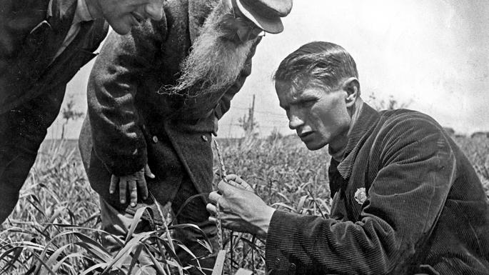
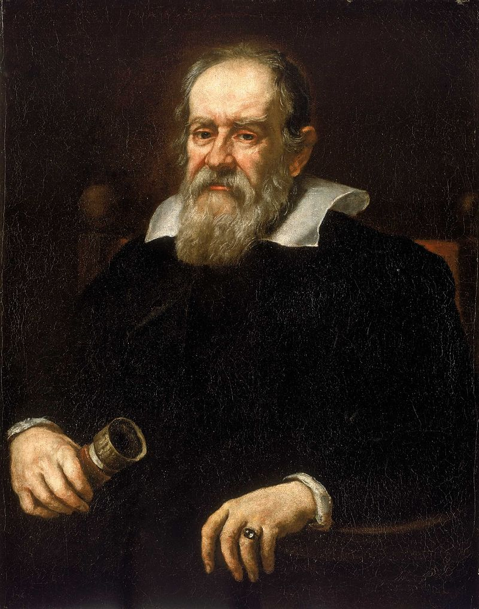
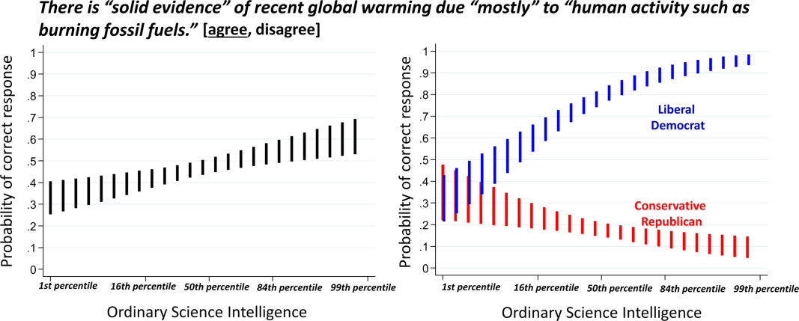
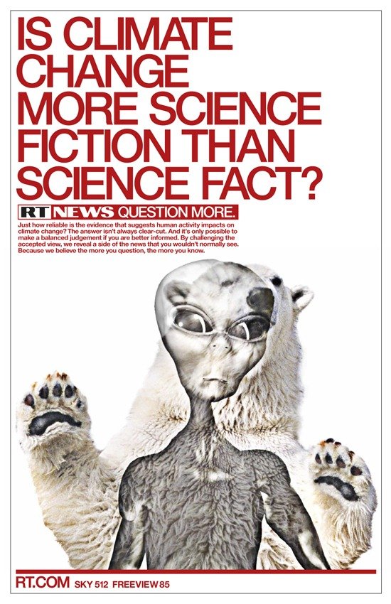
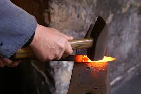

# 1. Quand le public apprend que la science est un champ de bataille

## cas 1

## cas 2

## cas 3

## cas 4

## Tensions entre Science et Politique

- Le politique a ménagé un espace de liberté pour la science. Cet espace évolue au gré des circonstances

- Les chercheurs ont des biais politiques, certains considèrent que la science ne doit pas contribuer à décrire le monde mais aussi à le changer

- Les "vérités scientifiques" ne doivent pas seulement s'imposer au politique et réciproquement.

- les scientifiques ne sont pas d'accord entre eux, la controverse est une modalité habituelle de la science.
  Mais cette controverse est censée améliorer le niveau des arguments

## écart avec la culture dominante de la science

La Science et la politique s'opposent fortement

## écart avec la culture dominante de la Science

La Science et la croyance s'opposent fortement

## écart avec la culture dominante de la science

- La Science est vue comme un acquis, moins comme un processus

- Le mot théorie n'a pas le même sens que dans la vie courante

- La conflictualité inhérente à la science est sous-estimée @ManiglierToutceque2021

## Une découverte de la nature de la science qui peut engendrer du scepticisme

- La Science risque de ne plus servir que de caution à un discours idéologique : "tu as tes experts, moi j'ai les miens".

- Une insistance sur le caractère soi-disant irréductible du dissensus scientifique pour faire visibiliser des points de vue très minoritaires

- La fabrique de dissensus artificiels (agnotologie) @OreskesMerchantsDoubt2011

- un discours critique de la Science (Latour) récupéré par les conservateurs @LatourWhyHasCritique.

## L'esprit critique utilisé contre la démarche scientifique

Une disposition qui touche les personnes les plus diplômées @KahanScienceCuriosityPolitical2017

## La question de la désintermédiation

vision néo-libérale (et protestante) de l'individu qui cherche par lui-même

# 2. Situer le problème des Fake News et les solutions proposées dans ce débat entre Science et politique

[Lien vers le Klaxoon](https://app.klaxoon.com/join/AXNNPWW)

# 3. Comment les bibliothèques universitaires en ont profité pour renouveler leur approche

## De l'évaluation de l'information à la "lutte contre les fake news"

Jusqu'à présent on enseignait surtout les points suivants :

- distinguer l'information scientifique (de la vulgarisation, de la presse non
scientifique)
- trouver l'info scientifique
- citer l'info scientifique

La question principale était : scientifique ou pas ?

## Effets de bord dans les bibliothèques universitaires

- Influence de l'EMI dans le secondaire, focalisé sur les *théories du
  complot* et la déradicalisation depuis les attentats de Charlie-Hebdo [@EustacheQuandmediasreeduquent2020a]
- Prise de conscience du rôle du bibliothécaire dans la formation du
  citoyen

Le questionnement englobe la presse généraliste et est devenue :

- fiable ou pas ?
- authentique ou pas ?
- *fake news or real* (Guardian)

## Le risque de la binarité

On designe des sources saines (New York Times, CNN, Guardian) et des
sources douteuses (Breitbart News, RT, Sun, Fox News)
Mais CNN et Le Monde modifient également notre perception du monde : *liberal* au sens @boydYouThinkYou2018
US mais aussi *neoliberal* (au sens de Walter Lippman)

Insister sur la déontologie journalistique, l'épistémologie

## Apport de nouvelles pratiques

- recherche de travail de vérification (fact-checking)
- application de méthodes propres à la vérification de l'information :
    lecture latérale @WineburgLateralReadingNature2019
  ([lateral reading](https://mediaserver.univ-rennes1.fr/videos/?video=MEDIA200831110405448)
- traçage de l'info au moyen de moteurs de recherche inverse d'images
- recherche en open source (méthode OSINT pour évaluer une source ou vérifier le contexte original d'une image [@BelvezeGeolocaliserdaterimage2020])

## Apport de nouvelles connaissances

Faire comprendre aux étudiants le rôle des biais cognitifs ou heuristiques
biais cognitif : une aide au quotidien sur les questions simples mais un obstacle pour la résolution des questions complexes.
CRT (Cognitive Reflection Test [@FrederickCognitiveReflectionDecision2005]

## Test CRT

{ width=50% }

> un nénuphar sur un étang double sa superficie tous les jours.
  Au bout de 48 jours il a recouvert l'étang.
  Au bout de combien de jours il en a recouvert la moitié ?

## Biais de confirmation

Expérience de Wason (@Wasonfailureeliminatehypotheses1960)

> Voici une suite de nombres : 2, 4, 6. Cette suite obéit à une
règle que j'ai fixée au préalable. Proposez à votre tour une suite de
trois nombres, je vous dirai si elle suit ma règle. Faites ensuite une
proposition de règle, et je vous dirai si c'est celle-ci qui a été fixée

## Pistes de travail avec les étudiants

- donner le goût de la vérification
- travailler sur les biais cognitifs

# 3. Place à la pratique

{ width="80%" }

[https://focus.univ-rennes1.fr/cfcb_fakenews]{latex-fontsize=huge}

# Bibliographie

\tiny

