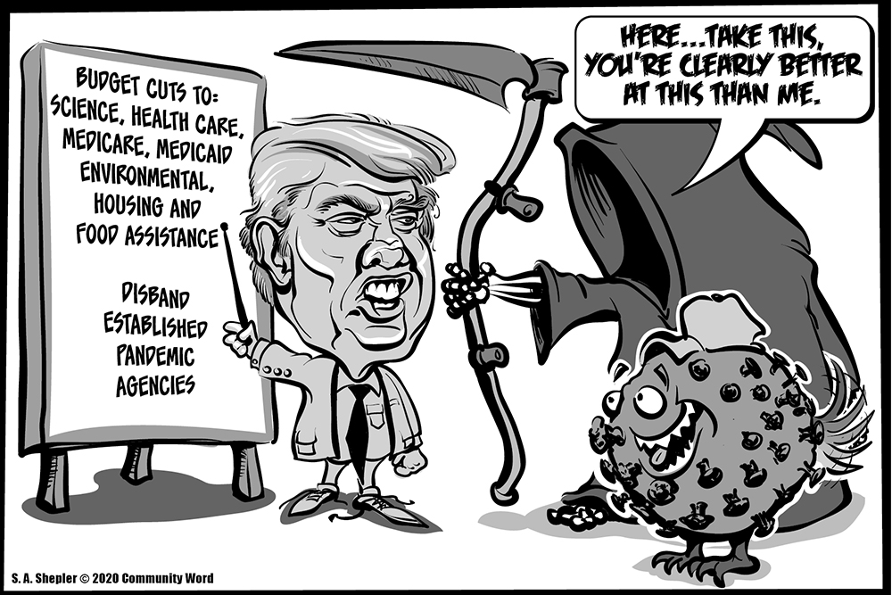
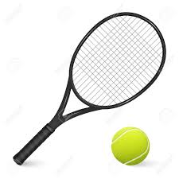
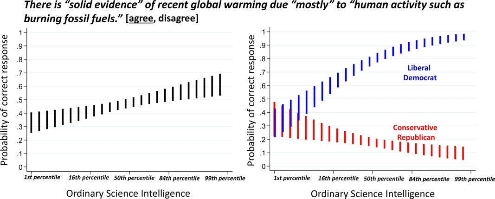
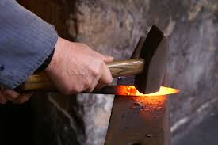

# 1. Comment les *fake news* sont devenues le thème à la mode

{ width="60%" }

## Brexit et élection de Donald trump

{ width="50%" }

Une conséquence de différentes grandes tendances :

- discrédit de la presse *mainstream* et de l'expertise (notamment dans le domaine médical)
- polarisation de la société accentuée par les bulles de filtrage [@PariserBewareonlinefilter2013]
- prolifération des fausses informations sur les réseaux sociaux accentué par la marchandisation des données personnelles (Cambridge Analytica)

## Une menace pour la Science

- Fin des financements accordés à certains types de recherche (environnement)
- Diffusion de fausses informations scientifiques par le gouvernement
- le populisme scientifique au pouvoir

## Populisme scientifique 1

Exploitation de l'*impuissance épistémique apprise* [@AlexEpistemicLearnedHelplessness2019]

> Nous ne vivons pas une crise sur ce qui est vrai, nous vivons une crise sur la façon dont nous savons si quelque chose est vrai. Nous ne sommes pas en désaccord sur les faits, nous sommes en désaccord sur l'épistémologie. La version "établie" de l'épistémologie est la suivante : "Nous utilisons des preuves pour arriver à la vérité, ces preuves sont examinées par une autorité indépendante (mais faites-nous confiance quand nous vous disons que tout a été vérifié de manière indépendante par des personnes qui étaient suffisamment sceptiques et non par les copains des personnes qui leur ont soumis ces faits et ces preuves)".

## Populisme scientifique 2

> La méthode épistémologique des "faits alternatifs" va au contraire avancer : Les experts "indépendants" qui étaient censés vérifier la vérité "fondée sur des preuves" étaient en fait au coude à coude avec les personnes dont ils étaient censés vérifier les faits. En fin de compte, c'est une question de foi : soit vous croyez que "leurs" experts sont sincères, soit vous croyez que nous le sommes. Demandez à votre instinct (ask your gut), quelle version vous semble la plus véridique ?

[@DoctorowThreekindspropaganda2017]

## Populisme scientifique 3

- désintermédiation de la recherche sur le Web
- bulle de filtrage et biais de confirmation
- détournement par la droite conservatrice de la théorie de la déconstruction
- prestige de la science mais incompréhension de la manière dont la science progresse (par consensus)
- prolifération de revues douteuses et crise de la reproductibilité

On arrive très vite à l'étude qui prouve ce que l'on croit

# 2. Comment les bibliothèques universitaires en ont profité pour renouveler leur approche

## De l'évaluation de l'information à la "lutte contre les fake news"

Jusqu'à présent on enseignait surtout les points suivants :

- distinguer l'information scientifique (de la vulgarisation, de la presse non
scientifique)
- trouver l'info scientifique
- citer l'info scientifique

La question principale était : scientifique ou pas ?

## Effets de bord dans les bibliothèques universitaires

- Influence de l'EMI dans le secondaire, focalisé sur les *théories du
  complot* et la déradicalisation depuis les attentats de Charlie-Hebdo [@EustacheQuandmediasreeduquent2020a]
- Prise de conscience du rôle du bibliothécaire dans la formation du
  citoyen

Le questionnement englobe la presse généraliste et est devenue :

- fiable ou pas ?
- authentique ou pas ?
- *fake news or real* (Guardian)

## Le risque de la binarité

On designe des sources saines (New York Times, CNN, Guardian) et des
sources douteuses (Breitbart News, RT, Sun, Fox News)
Mais CNN et Le Monde modifient également notre perception du monde : *liberal* au sens
US mais aussi *neoliberal* (au sens de Walter Lippman)

De même, il y a plusieurs nuances de scientificité

## Apport de nouvelles pratiques

- recherche de travail de vérification (fact-checking)
- application de méthodes propres à la vérification de l'information :
    lecture latérale ([lateral reading](https://mediaserver.univ-rennes1.fr/videos/?video=MEDIA200831110405448)
- traçage de l'info au moyen de moteurs de recherche inverse d'images
- recherche en open source (méthode OSINT pour évaluer une source ou vérifier le contexte original d'une image [@BelvezeGeolocaliserdaterimage2020])

## Apport de nouvelles connaissances

Faire comprendre aux étudiants le rôle des biais cognitifs ou heuristiques
biais cognitif : une aide au quotidien sur les questions simples mais un obstacle pour la résolution des questions complexes.
CRT (Cognitive Reflection Test [@FrederickCognitiveReflectionDecision2005]

## Test CRT

{ width=50% }

> une raquette et une balle de tennis coûtent ensemble 1,10 euro. La
raquette coûte 1 euro de plus que la balle de tennis. Combien coûte la
balle de tennis ?

## Biais de confirmation

Expérience de [@Wasonfailureeliminatehypotheses1960a]

> Voici une suite de nombres : 2, 4, 6. Cette suite obéit à une
règle que j'ai fixée au préalable. Proposez à votre tour une suite de
trois nombres, je vous dirai si elle suit ma règle. Faites ensuite une
proposition de règle, et je vous dirai si c'est celle-ci qui a été fixée

## La culture scientifique est-elle suffisante ?

Dissonance cognitive

## Pistes de travail avec les étudiants

- donner le goût de la vérification
- travailler sur les biais cognitifs

# 3. Place à la pratique

{ width="80%" }

https://focus.univ-rennes1.fr/cfcb_fakenews

# Bibliographie

